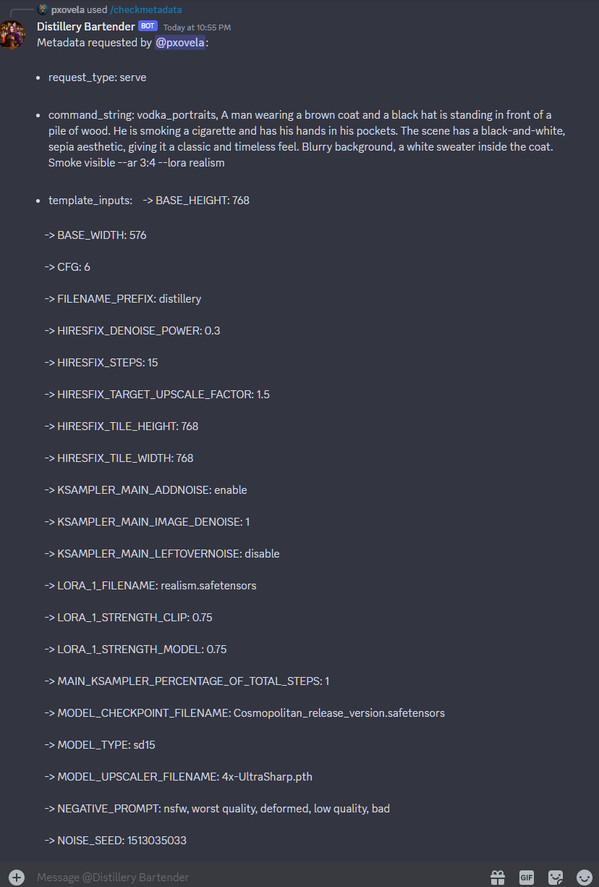

# Check Metadata

A simple command that allows users to view metadata embedded in images generated on Distillery. Simply type `/checkmetadata` followed by the Discord URL of the image that was generated in Distillery.

!!! tip "Metadata in Generated Images"
    Did you know that all Distillery generated images come with embedded metadata that contain detailed information on how the image was generated? You can download any image, and open it in any metadata viewer software. An example of a web tool for this is [Metadata2Go](https://www.metadata2go.com/view-metadata).

Seeing the image metadata can be particularly useful when replicating certain workflows and wanting to have a high level of control. This feature allows you to understand the settings, parameters, and versions used during the generation of the image, helping you replicate or improve upon the process.

```simpletext
/checkmetadata prompt:https://cdn.discordapp.com/attachments/1132614957863796846/1192160818087862413/distillery_1b3deef1-6f23-4c2c-935e-b846029ee449.png
```

You will notice that the metadata contains all the info matching the control parameters used in Distillery.

{: width="500px" }