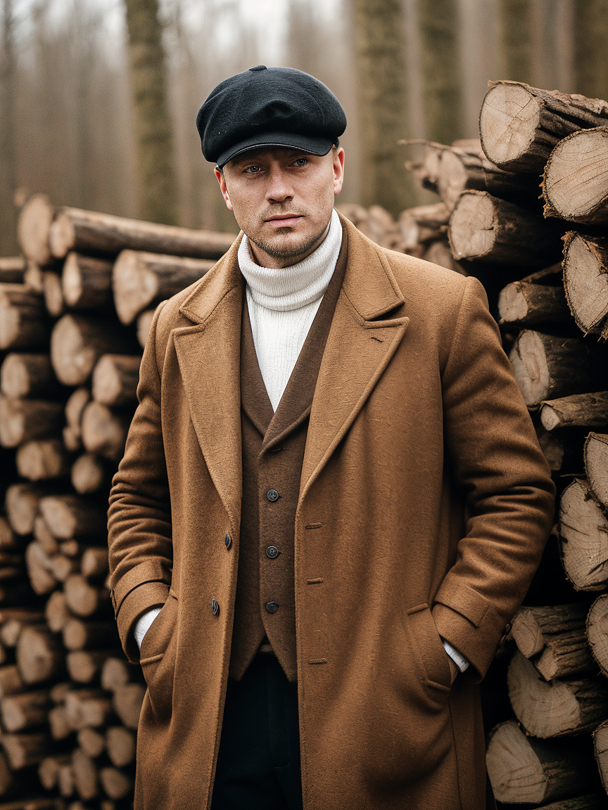
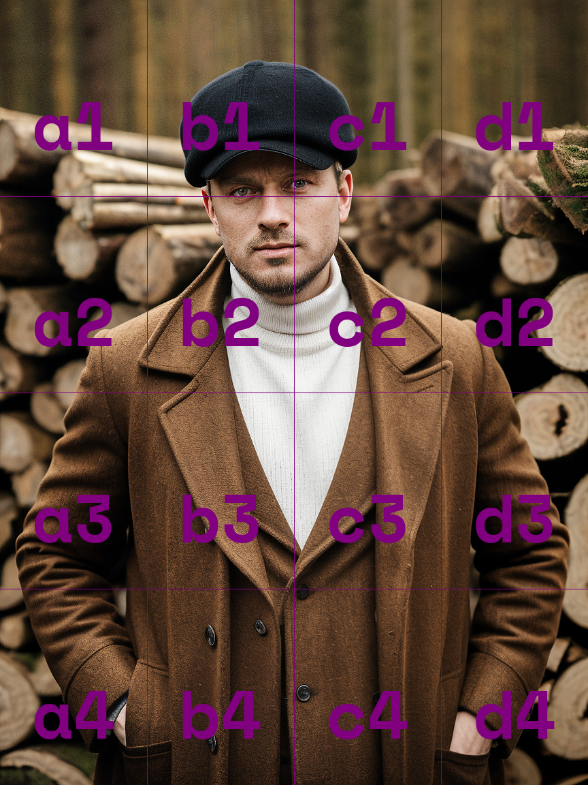
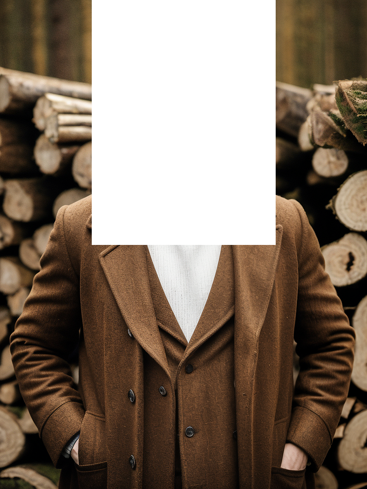
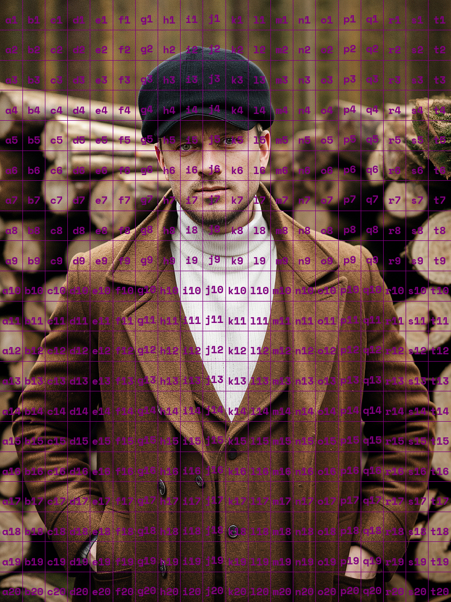
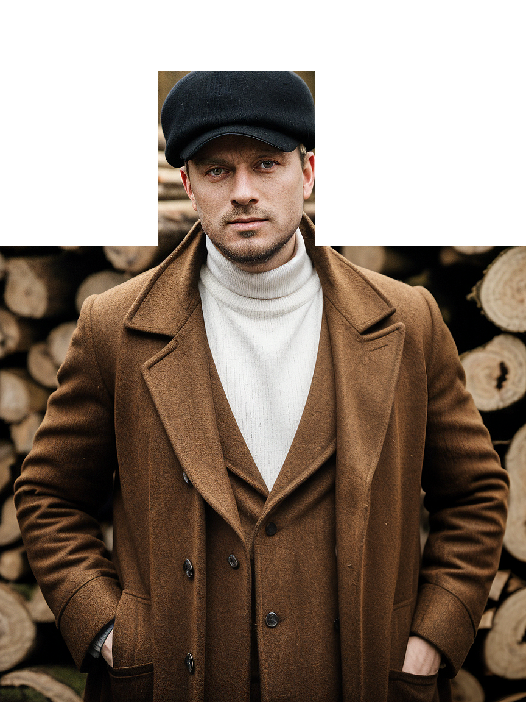

# Masking Overview

Masking is the concept of covering a part of the image with a special mask with the goal to use it for different purposes in your workflows. For example, in Distillery, you can use it as an input for [inpainting](../../Parameters/inpaint/inpaint.md). And in the future, we intend to introduce more features that require masked input.

In Distillery, we use masking in the fourth channel of the image called the Alpha channel, which allows preserving the original image in the usual channels (Red, Green, and Blue (RGB)).

You can create the masks on top of your desired image in any of your preferred ways (typically software like [GIMP](https://www.gimp.org/), Photoshop, etc). Distillery accepts those as long as it has a mask in the Alpha channel.

But given that Distillery today is Discord based, we wanted to also have a method allowing making masks with text prompts. Thus, we present you the `/makemask` workflow that allows mask creation using an "Excel-like" coordinate system. Let's go into details with a practical example.

## Available Additional Parameters for /makemask:
The default first inpup for the /makemask command is Discord based image url that will be masked. The image can be either Distillery generated or an external upload.

| Parameter      | Link to Docs (WIP, to be added)                  | Simple Overview   |
|----------------|--------------------------------------------------|-------------------|
| `--gridrange`     | See Above  |Select the range to be masked using Excel style coordinates. You can enter one or more comma separated coordinates. `--gridrange a3:b4, d7`                   |
| `--gridlines`     | See Above  |Enable displaying gridlines `--gridlines`                   |
| `--gridsize`      | See Above    |Adjust size of the grid `--gridsize 20` Ranges from 2 to 20|
| `--gridshape`     | See Above  |Choose the shape of the mask, either square or round `--gridshape round`                   |

## Practical Examples

Let's start with an image that we want to mask. It is a Distillery generated image but could be an external upload to Discord.

{: width="500px" }

### Basic Masking

To get a sense of what's going on, let's simply pass the image URL to the the /makemask command.

```simpletext
/makemask prompt:https://cdn.discordapp.com/attachments/1132614957863796846/1192160818087862413/distillery_1b3deef1-6f23-4c2c-935e-b846029ee449.png
```
{: width="500px" }

The result of this request is an image that has 4 by 4 grid painted on it. This is solely for the purpose of guiding users which coordinates to use.
Let's say we want to mask the face area which right now is contained within four cells: b1,c1,b2, and c2. The coordinates for this range will be denoted as b1:c2. We can now pass this range to the command to create the masked version of the image. Simply append --gridrange b1:c2 to the previous command with the URL.

!!! warning "Mask the original"
    Make sure to pass the url of the image that doesn't have coordinates printed on top of them when generating the mask. The coordinate display is for referance purpose only.

```simpletext
/makemask prompt:https://cdn.discordapp.com/attachments/1132614957863796846/1192160818087862413/distillery_1b3deef1-6f23-4c2c-935e-b846029ee449.png --gridrange b1:c2
```
{: width="500px" }

As we see, the targeted area is masked as expected. Now the url of this masked image can be used as an input for --inpaint or any other desired purposes.

### Adjusting Gridsize
You might have noticed that in the first example, besides the head area, a lot of the image was masked which might not always be the desired outcome. We can achieve finer level control by adjusting gridsize. Let's crank it up to the max of 20 by appending --gridsize 20 to the first command.

```simpletext
/makemask prompt:https://cdn.discordapp.com/attachments/1132614957863796846/1192160818087862413/distillery_1b3deef1-6f23-4c2c-935e-b846029ee449.png --gridsize 20
```
{: width="500px" }

Now, with the finer grid we can be a lot more precise which area to mask. Let's say we want it to mask from g2 through l8. We will do this by adding --gridrange g2:l8 to the previous command. Make sure to keep the --gridsize unchanged to apply this properly.

```simpletext
/makemask prompt:https://cdn.discordapp.com/attachments/1132614957863796846/1192160818087862413/distillery_1b3deef1-6f23-4c2c-935e-b846029ee449.png --gridsize 20 --gridrange g2:l8
```
{: width="500px" }

The result is much more targeted masked area that could allow preserving other parts of the image.

### Grid Shape
The masks are rarely drown in square shape and in many cases the hand drawn masks have complex shapes and various opacity. The text interface allows very limited control like that but at least the round or oval shapes work much better in cases like face so we can pass `--gridshape round` to adjust the shape of the mask. Let's modify the previous command by appending it with this parameter.

```simpletext
/makemask prompt:https://cdn.discordapp.com/attachments/1132614957863796846/1192160818087862413/distillery_1b3deef1-6f23-4c2c-935e-b846029ee449.png --gridsize 20 --gridrange g2:l8 --gridshape round
```
{: width="500px" }

As a result we got a lot more natural shaped mask for this use case.
Note that in certain cases square, default shapes are still more useful. For example think masking left or right half of the image for some creative generations.

### Multi Area Masking
In some cases more than one evenly connected areas of the image need to be masked. You could achieve this either in one go or by iteratevly masking one area at the time.
Let's take a look at multi area masking in this case. We will use the previous image with the `--gridsize 20` but in this case let's say we want to mask upper part of the background of the image.Let's say a1:f7, g1:l2, and and finally m1:t7. We will achieve this by passing comma separated list of ranges to the command `--gridrange a1:f7, g1:l2, m1:t7`.

```simpletext
/makemask prompt:https://cdn.discordapp.com/attachments/1132614957863796846/1192160818087862413/distillery_1b3deef1-6f23-4c2c-935e-b846029ee449.png --gridsize 20 --gridrange a1:f7, g1:l2, m1:t7
```
{: width="500px" }