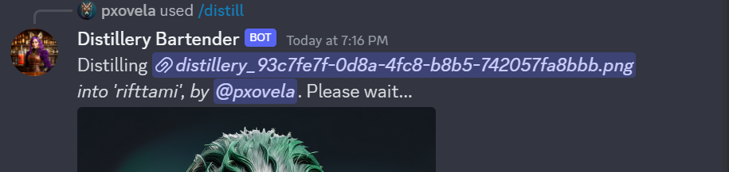

# /distill Command Usage

The `/distill` command works like any other commands on Distillery. For now, it only accepts one main input: an image URL:
- The input image can be either Distillery generated or anything external.
- The image URL must be a Discord URL, so make sure to upload the image to Discord first.

!!! tip
    When doing single image training, the quality of the input image is extremely important. The training is done at 768x resolution so ensure that the smaller side of the image is at least 768 pixels. Low noise, clear images, where the training subject is clearly visible, work much better.

### Example of /distill Command Launch
```plaintext
/distill prompt:https://cdn.discordapp.com/attachments/1132450797750337597/1200711915186442280/distillery_072e07ac-521f-4c4d-910b-f9e7494ba6ee.png
```
{: width="500px" }

Once the command is sent, if no errors occur, you will see a confirmation message such as:
{: width="500px" }

Finally, once the training is complete, you will see a confirmation message:
{: width="500px" }


When the `/distill` command is initiated, a unique name is assigned to the LoRA that is displayed both at the start of the training and once the training is finished. In this case, it was "rifttami". This name is crucial as it serves multiple purposes in Distillery:

### LoRA Name
- **LoRA Name**: In this case, 'rifttami' is the assigned name. This name can be used with the `--lora` parameter when you want to utilize this particular LoRA in your image generation.

### Activation Word
- **Activation Word**: The same 'rifttami' also serves as the LoRA activation word. This can be included in your text prompt. For more details, refer to the Single Image LoRA section.

### Managing LoRAs
- **Manage LoRA**: You can use the name 'rifttami' with the `/manage-lora` command to view or update details about this specific LoRA.

### User Statistics
- **User Stats**: When using the `/user-stats` command, 'rifttami' will be listed under the "Loras Owned" section, helping you keep track of your custom LoRAs.

