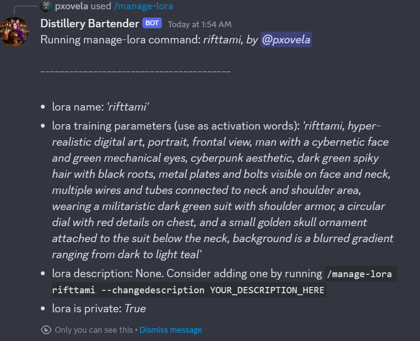

# Manage LoRA Command Overview

The `/manage-lora` command in Distillery provides users with a means to access and control various aspects of their LoRA (Low Rank Adaptation) models.

### Basic Usage
To use this command, input the LoRA name as a parameter. For example:

```plaintext
/manage-lora prompt:rifttami
```


{: width="500px" }

The response will display essential information about the specified LoRA, as shown in the example.

### Available Parameters

You have several options to manage your LoRA:

| Parameter           | Description                                             | Example Usage                        |
|---------------------|---------------------------------------------------------|--------------------------------------|
| `--makepublic`      | Toggles the LoRA to be public, allowing others to use it | `/manage-lora prompt:rifttami --makepublic` |
| `--makeprivate`     | Toggles the LoRA to be private                           | `/manage-lora prompt:rifttami --makeprivate` |
| `--changedescription` | Adds a simple description to your LoRA                   | `/manage-lora prompt:rifttami --changedescription "my face"` |
| `--showimage`       | Toggles to display the training image of the LoRA        | `/manage-lora prompt:rifttami --showimage` |
