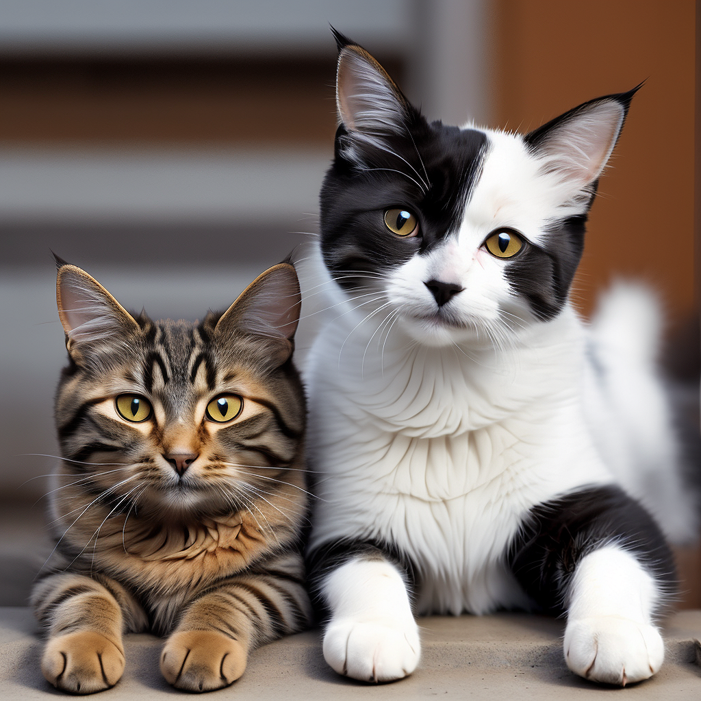
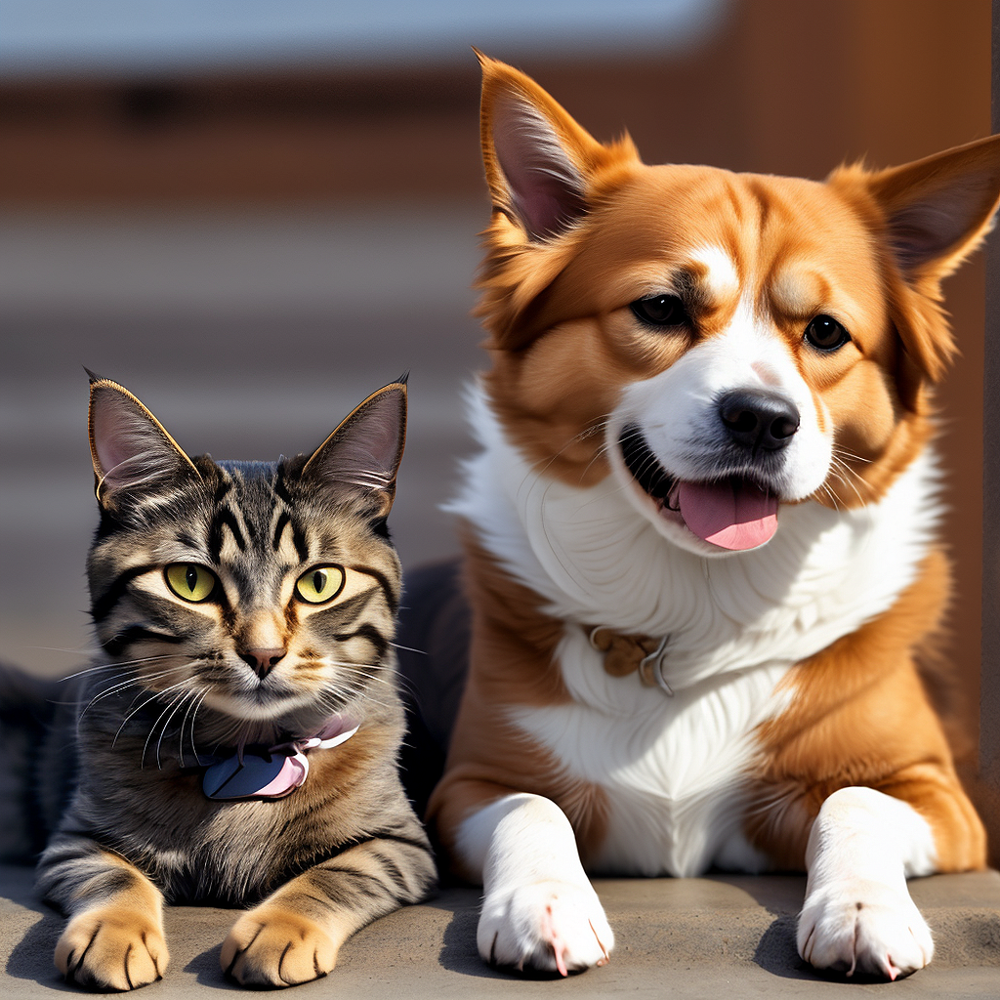
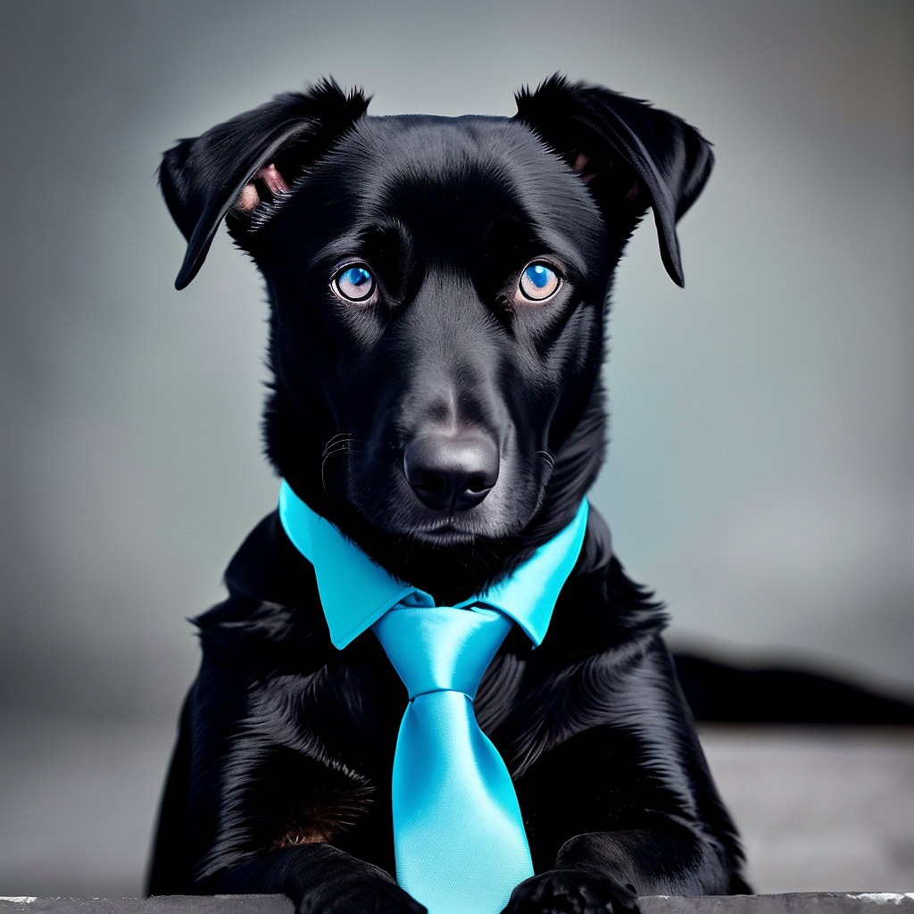
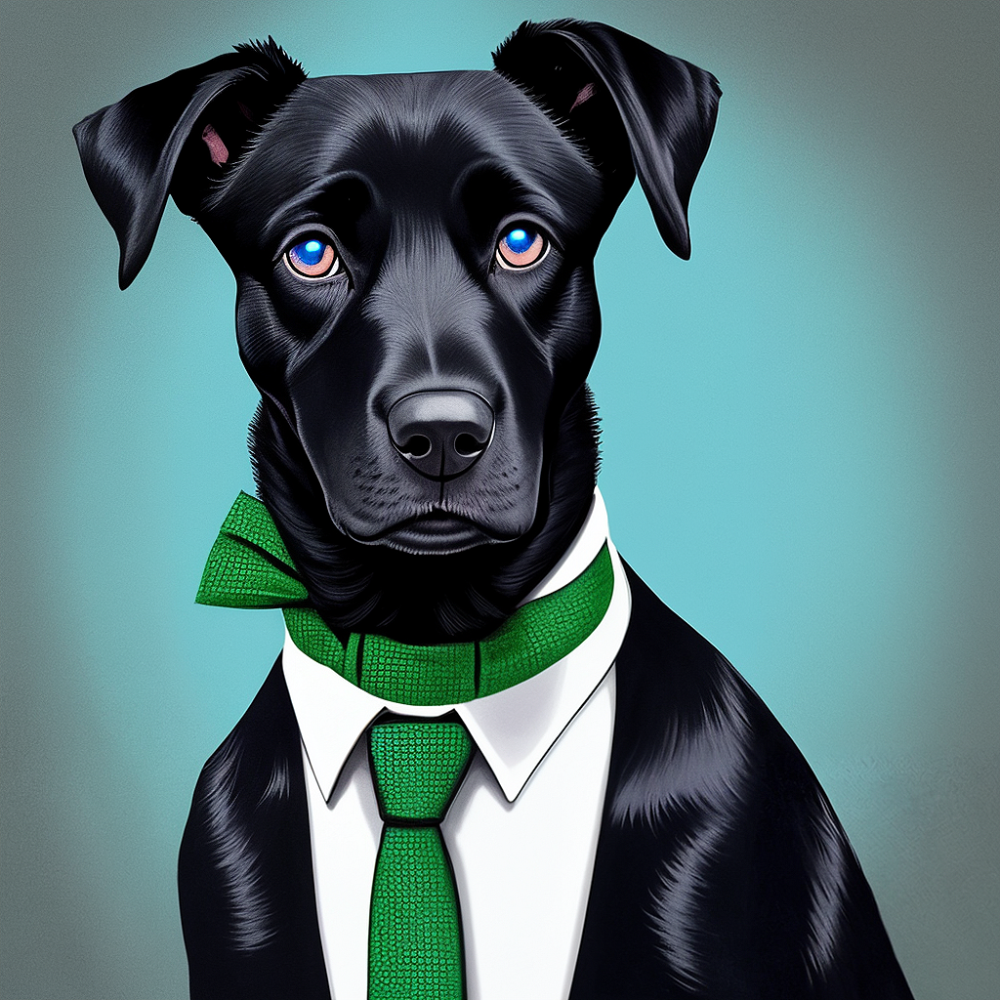
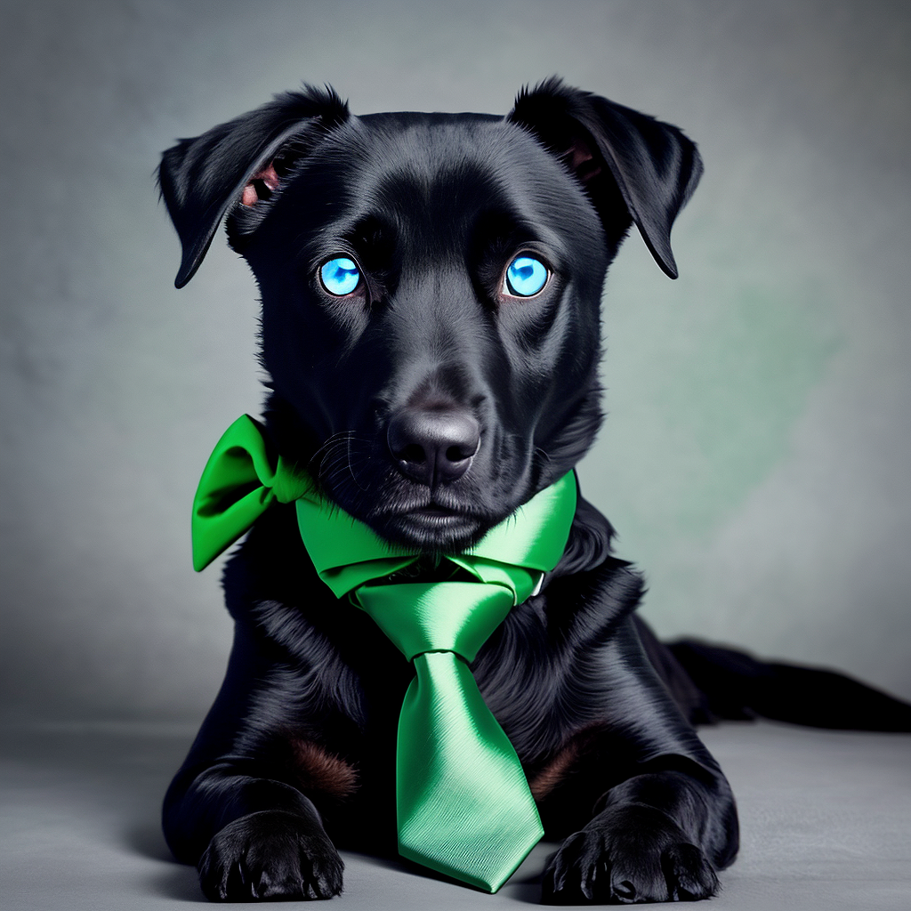

# Serve Overview
/serve is the main command on Distillery allowing text to image generation. In it's very basic form, type /serve followed by the descriptive text of the image that you'd like to generate. Example:

```simpletext
/serve prompt: old bartender in the bar with a long beard
```

!!! tip "Free Daily Trial"
    As a free-trial user you can instead use /serve-free command in special channels where trial generations are allowed.

However, using just a text input is a very basic approach at Distillery. Distillery really excels with its large feature list that allow users to achieve fine-level control over the image generation process. All with the terms and approaches that are openly disclosed and known by the AI Art enthusiasts.

Refer to the bellow list of parameters that can be added to /serve command to utilize the full functionality.

## Available Additional Parameters:

| Parameter             | Link to Docs (WIP, to be added)                                  | Simple Overview                    |
|-----------------------|-----------------------------------------------|------------------------------------|
| `--neg`               | [Negative Prompts](../../Parameters/negative_prompt/negative_prompt.md)  | Add Negative Prompt `--neg night`                   |
| `--seed`              | [Seed](../../Parameters/seed/seed.md)               | Control Image Generation Seed `--seed 123`                   |
| `--cfg`               | [CFG](../../Parameters/cfg/cfg.md)                 | Choose desired CFG value `--cfg 4.5`                   |
| `--ar`                | [AR](../../Parameters/aspect_ratio/aspect_ratio.md)                   | Choose image aspect ratio `--ar 16:9`                   |
| `--power`             | [Denoise](../../Parameters/denoise/denoise.md)             | Adjust hiresfix strength `--power 0.2`                   |
| `--model`             | [Models](../../Parameters/model/model.md)             | Choose which model to use `--model sdxl`                   |
| `--lora`              | [LORAs](../../Parameters/lora/lora.md)               | Apply up to 5 LoRAs to generation `--lora realism`                   |
| `--control`           | [Controlnet](../../Parameters/control/control.md)         | Guide image generation using controlnet input `--control `                   |
| `--image`             | [Image2image](../../Parameters/img2img/img2img.md)             | Use input image as a starting point `--image `                   |
| `--inpaint`           | [Inpainting](../../Parameters/inpaint/inpaint.md)         | Inpaint/change only the masked area of the image `--inpaint `                   |
| `--inpaintmaskfeather`| [Inpainting](../../Parameters/inpaint/inpaint.md) | Adjust feathering value when inpainting `--inpaintmaskfeather 2`               |
| `--inpaintmaskgrow`   | [Inpainting](../../Parameters/inpaint/inpaint.md)     | Adjust mask size when inpainting `--inpaintmaskgrow 20`               |
| `--cutoffweight`   | [serve](/)     | adjust cutoff weights `--cutoffweight 0.5`               |
| `--llm`               | [LLM](../../Parameters/llm/llm.md)                 | Modify your prompt with the help of LLMs `--llm crazy`                   |
| `--lcmweight`         | [Sampler](../../Parameters/sampler/sampler.md)     | Only applicable when LCM sampler is used                   |
| `--adapt, --adapt2, --adapt3, --adapt4` | [IPAdapters](../../Parameters/adapt/adapt.md) | use IPAdapters to prompt with images `--adapt `          |
| `--adaptweight`       | [IPAdapters](../../Parameters/adapt/adapt.md) | Adjust IPAdapter strength `--adaptweight 0.3`                   |
| `--adaptweight1, --adaptweight2, --adaptweight3, --adaptweight4` | [IPAdapters](../../Parameters/adapt/adapt.md) | adjust individual weights of IPadapters when using multiple adapters `--adaptweight2 0.2`          |
| `--adaptface`       | [IPAdapters](../../Parameters/adapt/adapt.md) | Toggle type parameters to switch on face IPadapter model `--adaptface`                   |
| `--sharpen`           | [Sharpen](../../Parameters/sharpen/sharpen.md)         | Adjust sharpening value `--sharpen 0`                   |
| `--sampler`           | [Sampler](../../Parameters/sampler/sampler.md)         | Change sampling method `--sampler lcm`                   |
| `--raw`               | [RAW](../../Parameters/raw/raw.md)                 | Disable some of the added processing for more control `--raw`                   |
| `--force-model`       | [Models](../../Parameters/model/model.md)  | Forces inpaint to work with the selected model (vs using inpainting-finetuned ones)    |
| `--controlweight`     | [Controlnet](../../Parameters/control/control.md) | Adjust strength of controlnets `--controlweight 0.3`               |
| `--inpaintcontrol`    | [Inpainting](../../Parameters/inpaint/inpaint.md) | SD15 only, adjust strength of controlnet used for inpainting `--inpaintcontrol 0`               |
| `--imagedenoise`      | [Image2image](../../Parameters/img2img/img2img.md)    | Adjust the portion of initial image to keep for image2image `--imagedenoise 0.8`               |
| `--upscalemethod`     | [Upscale](../../Parameters/upscale_method/upscale_method.md) | Choose the method to upscale or disable it. `--upscalemethod none`               |
| `--refinerpass`       | Refinerpass | SDXL only, choose portion of generation to be done with refiner model `--refinerpass 0.5`                   |

## Additonal Prompt Control with the Special Syntax

### Token Weights
Crafting Stable Diffusion prompts is a topic beyond this documentation but there are a few syntax tricks in Distillery that are worth discussing since they often get forgotten.

When writing a prompt, additional weights can be given to individual words or phrases within the prompt by adding parentheses around them. The effect can be amplified by increasing the number of parentheses added.
Alternatively, the same can be achieved by adding parentheses around the word and denoting specific multiplier for the increased weight.

For example if we start with a prompt `a cat and a dog` and want to increase the weight of the word `a dog`, we can write either `a cat and (a dog)` or `a cat and (a dog:1.1)`.
Each parentheses increases the value by 10%. Thus `a cat and ((a dog))` is equivalent to writing `a cat and (a dog:1.21)`. Then `a cat and (((a dog)))` is the same as `a cat and (a dog:1.331)` and so on. See it in action:

```simpletext
/serve prompt:a cat and a dog --seed 123
```
{: width="500px" }

```simpletext
/serve prompt:a cat and (a dog:1.21) --seed 123
```
{: width="500px" }

### Prompt Region Cutoffs

The cutoff feature is an advanced prompting-related feature allowing control over the effect that certain attributes have on specified subsets of the prompt. It is an implementation of the cutoff script ([Cutoff](https://github.com/BlenderNeko/ComfyUI_Cutoff?tab=readme-ov-file)) in Distillery and can be particularly useful in use cases with multiple subjects and detailed elements.

Unfortunately, the feature is still experimental and typically requires multiple attempts and alterations to get the desired results. However, when it works, it can be extremely powerful.

Given the specificity of the syntax, let's explore it with a practical example:

Let's say we want to generate an image of a black dog with blue eyes and a green tie.

```simpletext
/serve prompt:a black dog with blue eyes and a green tie --seed 123
```
{: width="500px" }

As it usually happens, we observe the prompt part 'blue' has bled beyond the intended eye part and turned the tie into blue as well.
Cutoff feature tries to addresses exactly this. It's achieved by the combination of two adjustments to the prompt syntax. 

First, the region within which the prompt should be contained is constrained with the double colons from both sides. So in this case `::blue eyes::`. And then, the word to which the prompt part needs to be applied must be capitalized. So in this case we end up with `::blue EYES::`. The new prompt and the result looks like this:

```simpletext
/serve prompt:a black dog with ::blue EYES:: and a green tie --seed 123
```
{: width="500px" }

Even if not perfect, we see that now blue color is no longer applied to the tie.
With a bit more experimentation, and given the fact that cutoff trick can be applied to multiple parts of the prompt, we ended up with a prompt like this:

```simpletext
/serve prompt:a black dog with ::(blue EYES):: and a ::(green TIE):: --seed 123
```
{: width="500px" }

And the result is much closer to the original intent.