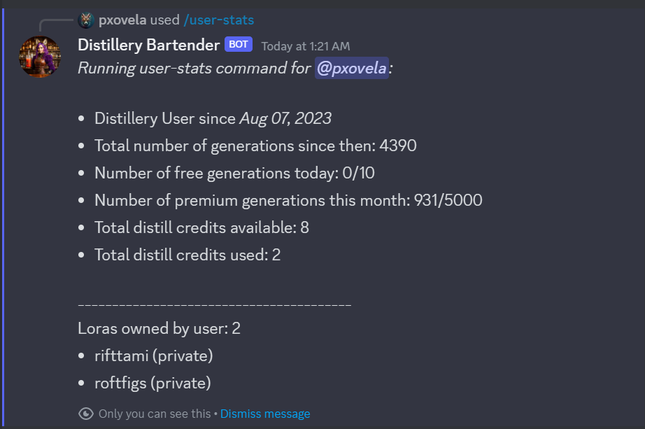

# User Stats Command Overview

The `/user-stats` command in Distillery offers users a quick and easy way to view their current status and usage statistics. This command provides a snapshot of your activity and resources in Distillery.

### How to Use
To use this command, simply type and send `/user-stats` in the chat. No additional parameters are required.

### Response Structure
Upon executing the command, you'll receive a response from the Bartender. This response will typically look like this:

{: width="500px" }

The response includes three primary categories of information:

#### 1. General Statistics
This section provides general information about your account, including:

- Join Date: The date you joined Distillery.
- Total Number of Generations: The cumulative count of generations requested using Distillery.

#### 2. Credits and Usage
Here, you'll find details about your available resources:

- Number of Generations Available and Used: Both for free and premium workflows.
- LoRA Training Credits: Information on your available and used `/distill` credits for LoRA training.

#### 3. Owned LoRAs
This part lists all the LoRAs you own, along with essential details about each.

