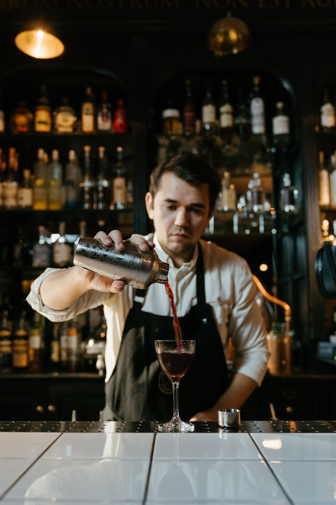
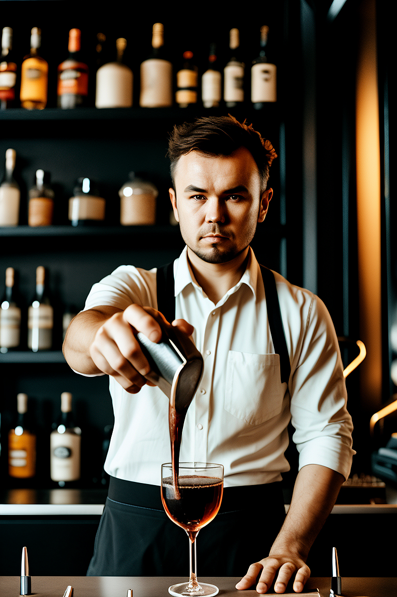
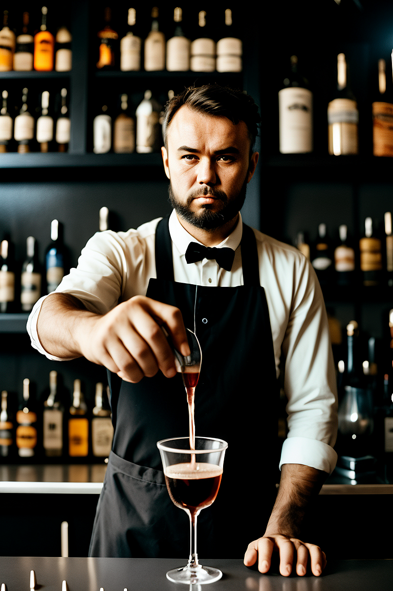
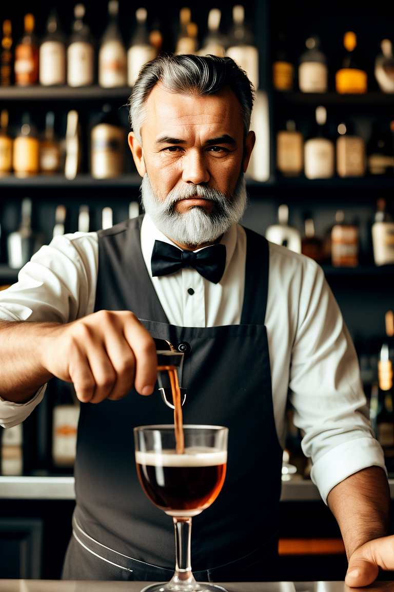

# Overview

`--adapt` is our implementation of IP-Adapter (https://ip-adapter.github.io) by Tencent AI Lab in Distillery, allowing users to prompt models using images. It's one of the few ways you can input your images during the generation process. To utilize it effectively, it's important to understand the underlying differences.

- `--image` ([Image to Image](../img2img/img2img.md)) uses the user input image as a starting point, meaning that instead of starting from an empty canvas, the generation process starts directly from the input image.
- `--control` ([Controlnet](../control/control.md)) uses the input image to guide the image generation process. For example, it takes the outline of the input image and guides the generation to follow that outline.

Unlike the above two, when using `--adapt`, the original image is not directly used during the generation process. As the name IP Adapter suggests - it is an image prompt adapter. Basically, an adapter for text to image models that allows the model to 'perceive' the input image as a prompt. As the authors of the paper mention, "an image is worth a thousand words," and indeed, it is a powerful tool that comes with a bit of a learning curve but gives a whole lot of new capabilities to the model.

On Distillery, you can reference up to four images per generation with this method, and we will go into practical examples below.

## Basic Usage:


Before diving into practical examples, let's understand the syntax and options available for `--adapt`.

### Syntax Overview:

| Parameter Name  | Is Required? | Syntax               | Description                                         |
|-----------------|--------------|----------------------|-----------------------------------------------------|
| `--adapt`       | Required     | `--adapt <URL>`      | First image input to be referenced.                 |
| `--adaptweight` | Optional     | `--adaptweight 0.9`  | Adjust IP Adapter weight. Default 0.7. Range 0-1.   |
| `--adapt2`      | Optional     | `--adapt2 <URL>`     | Optional second image input.                        |
| `--adapt3`      | Optional     | `--adapt3 <URL>`     | Optional third image input.                         |
| `--adapt4`      | Optional     | `--adapt4 <URL>`     | Optional fourth image input.                        |

Each `--adapt` parameter requires a URL that points to an image. You can use up to four images per generation, allowing for complex and nuanced image generations. The `--adaptweight` parameter adjusts the strength of the IP Adapter's influence on the generation process, allowing you to fine-tune how much the provided images impact the final result.

### Simple Example:
Let's start with this image from pexels.com. We uploaded it on Discord and got an URL.

{: width="500px" }

Now imagine crafting extremely detailed prompt that describes everything in this image and passing it to the model. That is kind of what the IP Adapter does, with the main difference that instead of describing it with human understandable words, it describes it to the model by using number matrixes.

To get the sense what happens, let's send empty text prompt with the adapter image as an input.
```plaintext
/serve prompt:. --adapt input_adapt_baf027fc-66e5-4416-820e-9efa53b3317a.jpeg --ar 2:3
```

{: width="500px" }

### Adjusting `--adaptweight`:

`--adaptweight` is a powerful and important lever that needs to be mastered to use it effectively. What's tricky is that `--adaptweight` behaves differently with different input images, models, and LoRA combinations. A good strategy is to find the lowest value where the resemblance with the source image is at an acceptable level, use it to achieve whatever goal you have in mind, and start adjusting accordingly.

Let's say we want to turn our bartender into an older, bearded man. We will use the text prompt to guide the generation towards this end, however, at the default `--adaptweight` of 0.7, we see very little effect of the text prompt. It added some beard but the man is not old and we were expecting some gray beard:

```plaintext
/serve prompt:old bartender with gray beard --adaptweight 0.7 --ar 2:3 --adapt input_adapt_baf027fc-66e5-4416-820e-9efa53b3317a.jpeg
```
{: width="500px" }

But, if we adjust the --adaptweight to 0.4, we see the text influence is just right:
```plaintext
/serve prompt:old bartender with gray beard --adaptweight 0.4 --ar 2:3 --adapt input_adapt_baf027fc-66e5-4416-820e-9efa53b3317a.jpeg
```
{: width="500px" }