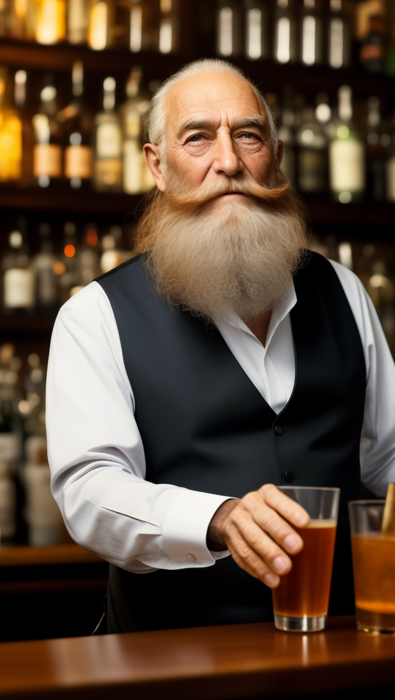
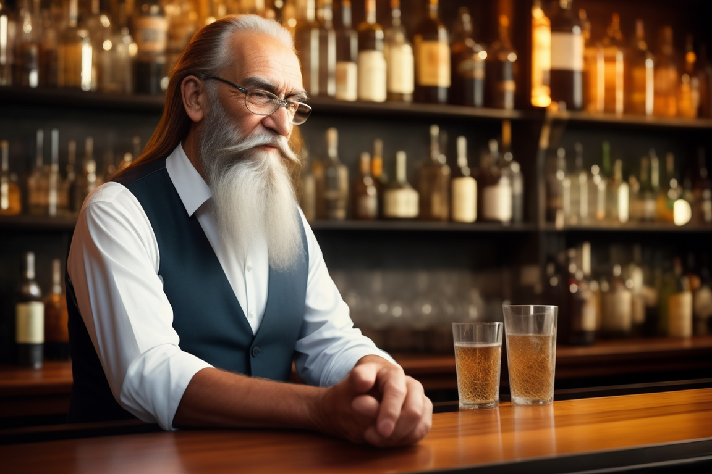

# Aspect Ratio (`--ar`)

The `--ar` parameter offers flexibility in setting the desired aspect ratio for your image generations. Not all images need to be square; the aspect ratio lets you dictate the dimensions.

Supported aspect ratios include:

### Supported Aspect Ratios
#### SD1.5 models:
- `1:1`, `2:1`, `3:2`, `4:3`, `5:3`, `5:4`, `16:9`
- Portrait Versions: `1:2`, `2:3`, `3:4`, `3:5`, `4:5`, `9:16`

#### SDXL models:
- `1:1`, `8:5`, `4:3`, `3:2`, `7:5`, `16:9`, `21:9`, `19:9`
- Portrait Versions: `5:8`, `3:4`, `2:3`, `5:7`, `9:16`, `9:21`, `9:19`


!!! note 
    Users can specify any desired aspect ratio using the format `width:height` (e.g., `--ar 9:16`). If an unsupported ratio is provided, the system will approximate to the nearest supported one.

You can combine the `--ar` parameter with other parameters for more tailored results.

## Practical Example

Let's see this in action using our earlier bartender example.

**Starting Image Prompt:**

```plaintext
/serve-free prompt: old bartender in the bar with a long beard --seed 123
```

{: width="500px" }

Modifying with 9:16 Aspect Ratio:

```plaintext
/serve-free prompt: old bartender in the bar with a long beard --seed 123 --ar 9:16
```
We can see that the new image got a new aspect ratio as expected: 

{: width="500px" }

!!! note 
    Aspect ratio also changes the image composition quite a bit

Finally, let's see what happens if we input unsupported 27:18 Ratio:

```plaintext
/serve-free prompt: old bartender in the bar with a long beard --seed 123 --ar 27:18
```

The aspect ratio got autocorrected to 3:2.
And the final image with the adjusted ratio is as follows:

{: width="700px" }

