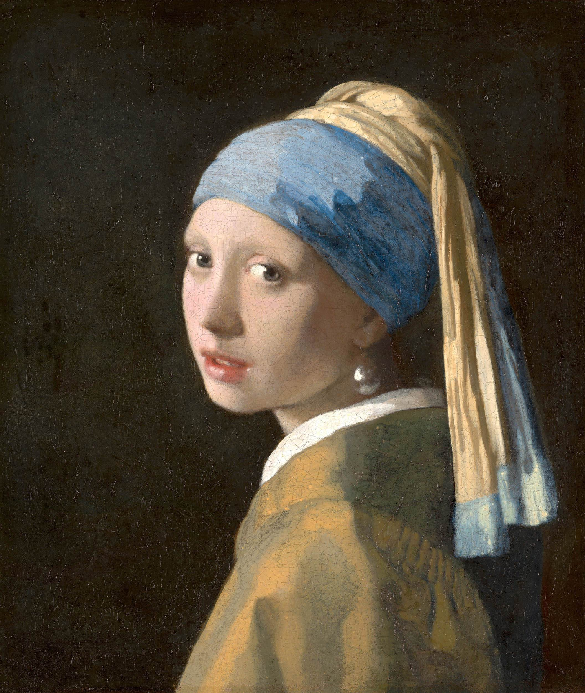
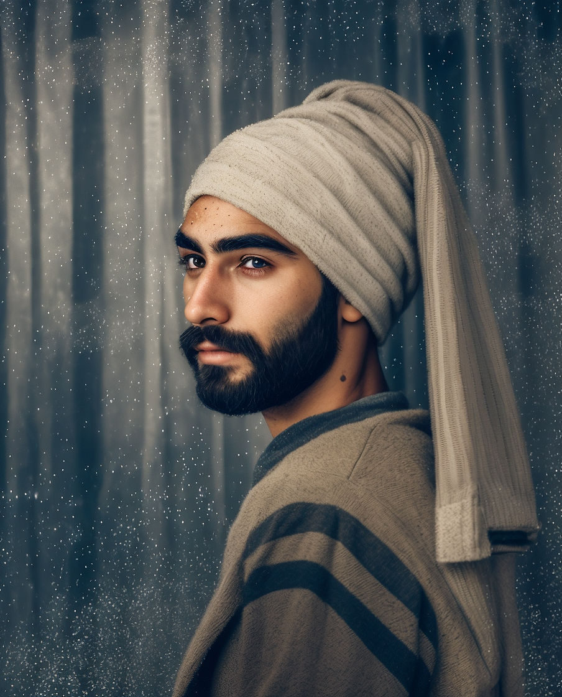
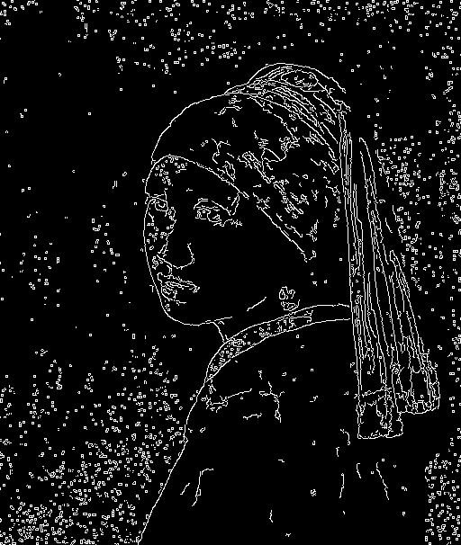
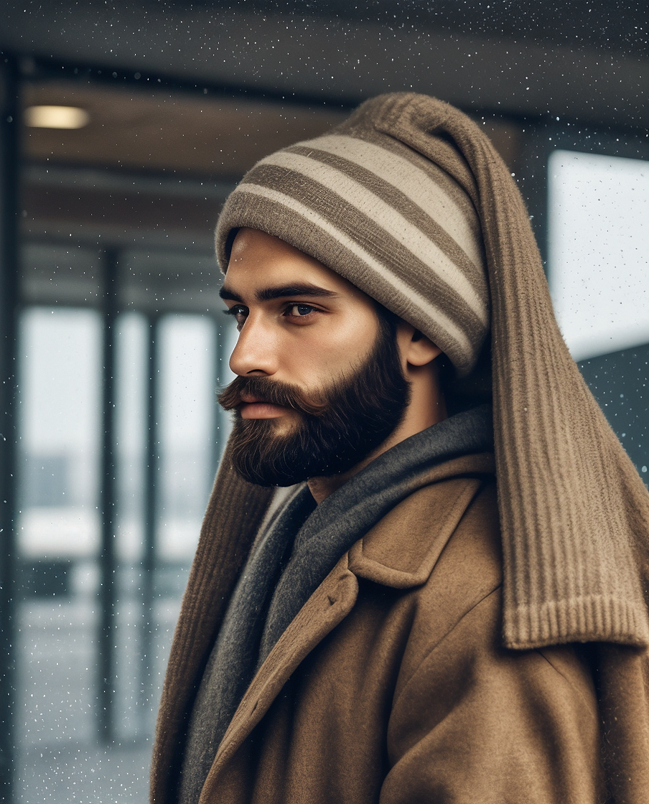
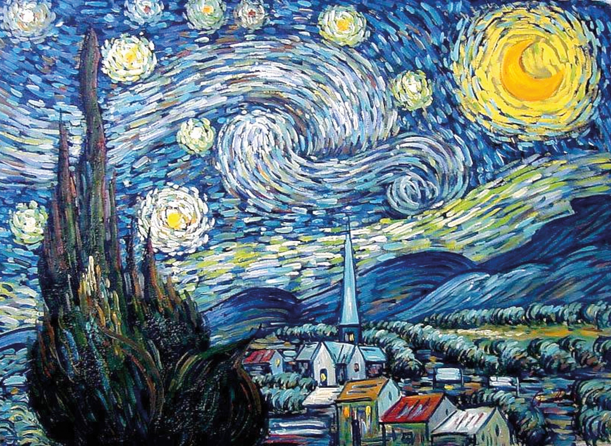
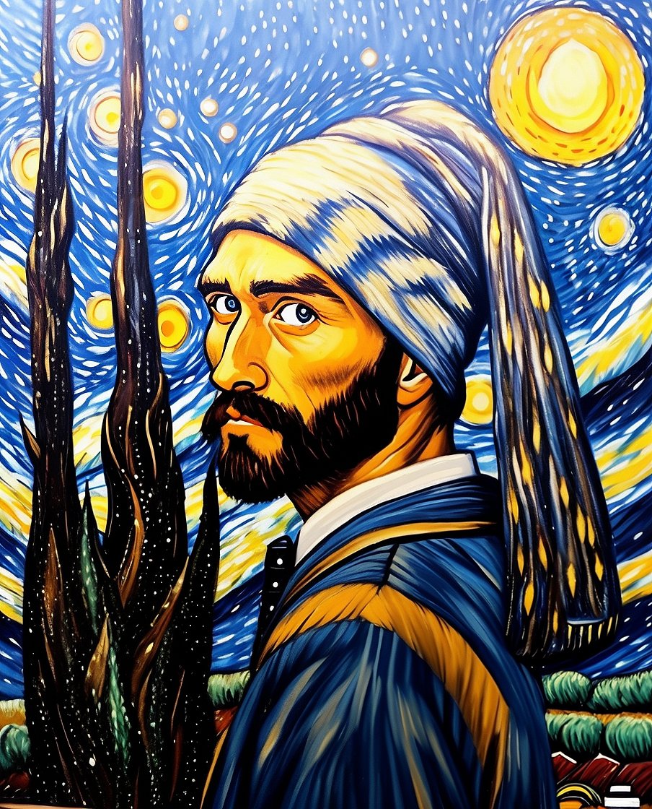

# Controlnet

`--control` is our implementation of ControlNet ([ControlNet Paper](https://arxiv.org/abs/2302.05543v3)) in Distillery. The feature allows users to provide a reference image as an input that will guide the image generation process. In essence, ControlNets are additional AI models that help StableDiffusion to generate images in the desired ways by referencing the conditioning image.

There are many kinds of ControlNets available, but for now, Distillery has only implemented CannyEdge. We will show an example of what exactly it does visually, but in essence, it generates an outline of the provided image, and then Controlnet attempts to guide the newly generated image in that direction.

What makes ControlNet extremely powerful is the fact that it can be used in combination with all other features in Distillery (IPAdapters, Image2image, LoRAs, and so on).

### Syntax Overview:

| Parameter Name   | Is Required? | Syntax               | Description                                        |
|------------------|--------------|----------------------|----------------------------------------------------|
| `--control`      | Required     | `--control <URL>`    | The image input to be used as conditioning.        |
| `--controlweight`| Optional     | `--controlweight 0.5`| Adjust Controlnet weight. Default 0.75. Range 0-1. |

The `--control` parameter requires a URL that points to an image with a Discord URL. The `--controlweight` parameter adjusts the strength of the Controlnet's influence on the generation process.

!!! tip "Aspect Ratio"
    Matching the aspect ratio of the ControlNet input generally improves quality. You can simply add --ar 900:600 (match it to the input image value) and it will be converted into accepted value automatically.

### Examples

Let's start with a simple input image for ControlNet.

{: width="500px" }

Let's try to generate "a man with beard" while guiding that image generation using the ControlNet:
```plaintext
/serve prompt:a man with beard --ar 4:5 --seed 123 --control input_control_cfe49c6a-f3b7-4f08-b04c-79ec22d4fb62.jpg
```
{: width="500px" }

As you can see, the outline of the input image has been followed quite closely while colors, style, subject, and other details of the input have been mostly ignored. This is in fact the goal and the main power of ControlNet.

To get a sense what happens in the background, after sending the prompt, system generates a Canny map like this and then uses that to guide the generation:

{: width="500px" }

To get a sense how `--controlweight` impacts the following, let's decrease it to 0.4 and redo the generation.

```plaintext
/serve prompt:a man with beard --ar 4:5 --controlweight 0.4 --seed 123 --control input_control_21a23dd0-ab99-4f6f-8635-e96e33a63856.jpg
```
{: width="500px" }

### Combining with other tools (Controlnet + IPAdapter)

Let's say we want to adjust the style of the image by using another input image.
Using IPAdapter is one of the ways that allows that in Distillery. So let's say we add a new input image for the style purpose.

{: width="500px" }

After adjust a prompt a bit to guide the image towards desired direction and tweaking --controlweight and --adaptweight values we end up with a prompt like this

```plaintext
/serve prompt:a man with beard, painted in style of starry night by van gogh --adaptweight 0.7 --ar 4:5 --controlweight 0.4 --seed 123 --adapt input_adapt_7abd9977-8ae4-40d3-83d8-9ffe911aac3f.jpg --control input_control_21a23dd0-ab99-4f6f-8635-e96e33a63856.jpg
```

{: width="500px" }

As you can see the combination results in something very powerful.