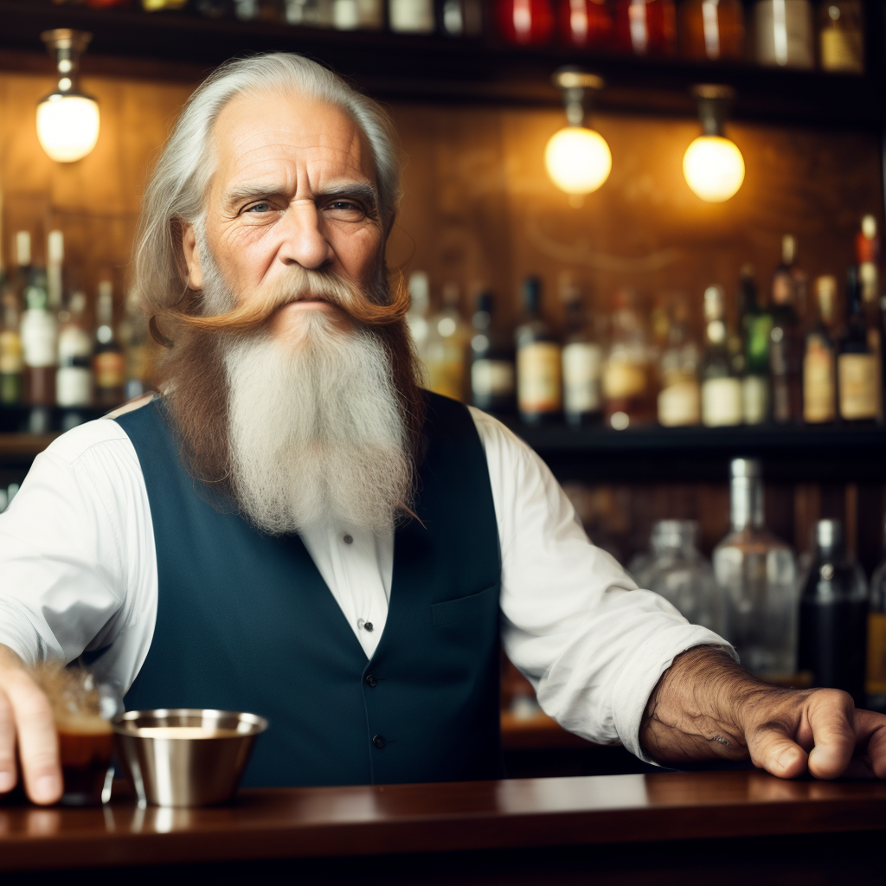

# Denoise Strength (`--power`)

Denoise Strength, indicated by the `--power` parameter, is an essential tool for controlling the quality of upscaled images in our system.

## Overview

- **Default Value**: `0.3`
- **Description**: The `--power` parameter adjusts the strength of the upscaling algorithm. A higher value means the upscaling is more aggressive, resulting in a more pronounced denoising effect. Conversely, a lower value yields a more subtle, nuanced effect. Using this lever, you can influence the clarity and fidelity of generated images, especially during the upscaling process.

## Deep Dive

All generated images undergo upscaling. This process can sometimes introduce noise or other undesired effects. By providing the `--power` option, we grant users the ability to adjust the denoise strength and, consequently, the image's final appearance. 

!!! note
    The `--power` parameter is compatible with all commands, including `/serve`, `/zoomout`, and `/upscale`. It's crucial to mention that the `/upscale` command is particularly sensitive to this parameter. If hallucinations appear in the image, reducing the `--power` value can often rectify the issue.

## Practical Demonstration

To understand the parameter's impact, let's evaluate it in action:

1. **Default Value Example (`--power 0.3`)**:

```plaintext
/serve-free prompt: old bartender in the bar with a long beard --seed 123
```

{: width="500px" }

**High Value Example (--power 0.7)**:

This value is atypical and might produce hallucinations.

```plaintext
/serve-free prompt: old bartender in the bar with a long beard --seed 123 --power 0.7
```
{: width="500px" }

Observation: As expected, the generated image is filled with hallucinations, scattering the main subject everywhere.

**Low Value Example (--power 0.1)**:

```plaintext
/serve-free prompt: old bartender in the bar with a long beard --seed 123 --power 0.1
```

The hallucinations are noticeably reduced. However, the image might lack some of the finer details present in the original.

{: width="500px" }
