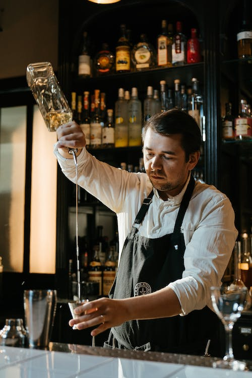
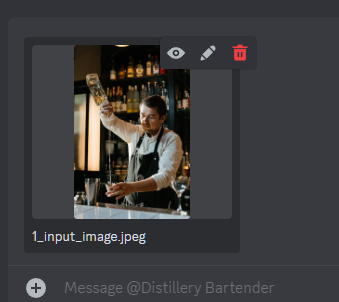
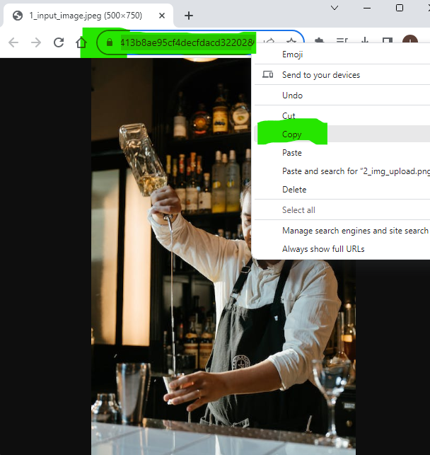
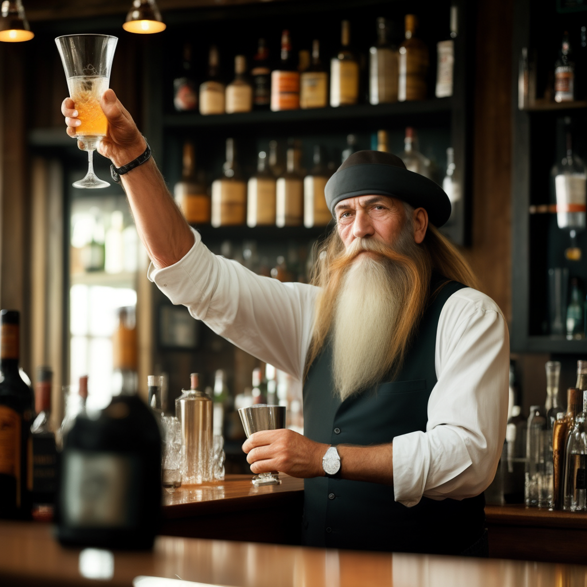

# Image-to-Image Generation (`--image`)

Leverage the power of Distillery's generative models with the `--image` parameter. Instead of starting from a blank canvas, initiate the generation process from an existing image, letting the model draw inspiration from the given visual to craft something new and mesmerizing.

## How To Use

Using the `--image` parameter is straightforward. Here's a step-by-step guide:

### Step 1: Image Selection

Choose an image. This can be one that you've previously generated using Distillery or any other image of your choice.

**Note**: If you're utilizing an external image, proceed to upload it to the Distillery Discord.

{: width="500px" }

### Step 2: Upload to Discord

Drag and drop your chosen image into the Distillery Discord chat, be it a channel or a direct message with the bot.

{: width="500px" }

### Step 3: Copy Image URL

Open the uploaded image in a browser window and copy its URL.

{: width="500px" }

### Step 4: Crafting the Command

Combine the regular `/serve` (or `/serve-free`) command, your desired prompt, and the `--image` parameter with the copied URL.

```plaintext
/serve-free prompt: old bartender in the bar with a long beard --seed 123 --image https://cdn.discordapp.com/attachments/1132614957863796846/1159096699197857854/1_input_image.jpeg?ex=651ea46c&is=651d52ec&hm=87eee79487380fa09080eb5dd4ecbdf9dfd93a5413b8ae95cf4decfdacd32202&
```

### Step 5: Witness the Transformation

After sending the command, be patient as the model works its magic. The final image will be deeply influenced by the initial input, merging the prompt's guidance with the source image's essence.

{: width="500px" }

## Tips

!!! tip
    **Aspect Ratio Alignment**: For optimal results with the `--image` command, ensure your source image's aspect ratio aligns with the target output.

!!! tip
    **Progressive Refinement**: Repeatedly applying the image-to-image generation can enhance nuances and correct imperfections, producing increasingly refined visuals.

## Under the Hood

normally stable diffusion starts from the empty canvas, adds noise, and then removes the noise in a way that generates an image. In this case, instead of starting from an empty canvas, it starts from an existing image, and then repeats all the other steps. 
