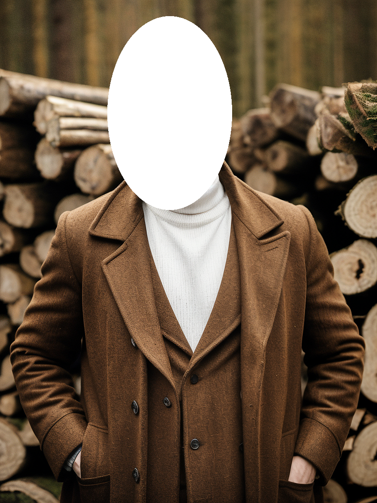

# Inpainting with Distillery

`--inpaint` is a feature in Distillery that allows users to edit only certain parts of the image while leaving the rest of the image untouched. Inpainting can be applied to either an image that has been generated in Distillery, or an external image uploaded to Discord. 
The input image to `--inpaint` command must contain a masked area in Alpha channel. See details in [Making Masks](../../Distillery%20Workflows/makemask/makemask.md). The mask can be either generated in Distillery using `/makemask` command or using a third party image editing tools.

On top of the required text prompt followed by `--inpaint <masked image URL>` format, inpainting workflow has a few additional optional parameters for higher level of control.

!!! tip "Aspect Ratio"
    Matching the aspect ratio of the Inpainting input generally improves quality. You can simply add --ar 900:600 (match it to the input image value) and it will be converted into accepted value automatically.

### Syntax Overview

| Parameter Name         | Is Required? | Syntax                   | Description                                                                                      |
|------------------------|--------------|--------------------------|--------------------------------------------------------------------------------------------------|
| `--inpaint`            | required     | `--inpaint <URL>`        | The image to be inpainted with the mask in Alpha channel                                         |
| `--inpaintcontrol`     | optional     | `--inpaintcontrol 0.5`   | SD15 only, adjust strength of controlnet used for inpainting. Range from 0 to 1                  |
| `--inpaintmaskfeather` | optional     | `--inpaintmaskfeather 20`| Number of pixels to be feathered around mask. Can make inpainting smoother. Default 10. Range 0 to 40 |
| `--inpaintmaskgrow`    | optional     | `--inpaintmaskgrow 15`   | Number of pixels by which to grow the mask. Various settings can improve outcome in individual cases. Default 10. Range 0 to 40 |

## Practical Examples

Let's start with an image generated in Distillery with the following prompt:
```simpletext
vodka_portraits, A man wearing a brown coat and a black hat is standing in front of a pile of wood. He is smoking a cigarette and has his hands in his pockets. The scene has a black-and-white, sepia aesthetic, giving it a classic and timeless feel. Blurry background, a white sweater inside the coat. Smoke visible --ar 3:4 --lora realism
```
{: width="500px" }

Using /makemask feature [Making Masks](../../Distillery%20Workflows/makemask/makemask.md), we covered the face with a mask.

{: width="500px" }

Then we altered the original prompt to change the face to a female one and focus the prompt on the face part. Added --inpaint parameter across with the url of the masked image.

```simpletext
/serve prompt:A woman's face in front of a pile of wood. The scene has a black-and-white, sepia aesthetic, giving it a classic and timeless feel. Blurry background --ar 3:4 --seed 123 --inpaint input_inpaint_b7da1909-6022-4072-bd7a-0f79464ff21a.png
```
{: width="500px" }