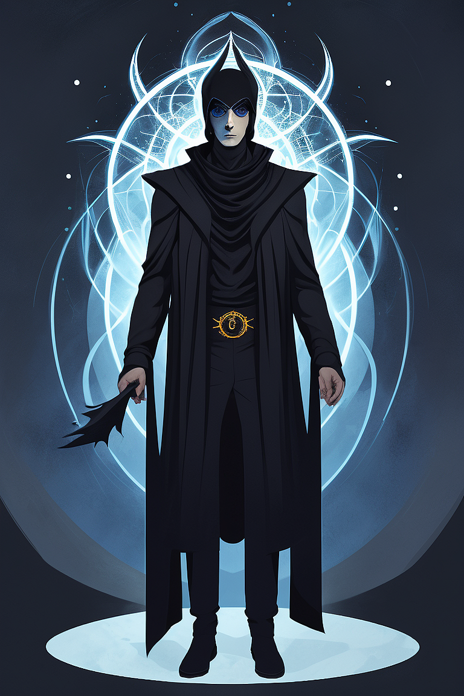

# LLM Prompt Helper

LLM Prompt Helper is an early version of prompt helper that is being designed for Distillery. You can see full details and guide on how our first version (--llm crazy) was built on our blog [here](https://followfoxai.substack.com/p/fine-tune-gpt-35-for-stable-diffusion).

The basic idea is very straightforward - specially fine-tuned LLM (Large Language Model) is used to modify simple prompt from the user and turn it into something more interesting, tailored to Distillery, or even crazy.

!!! tip
    **LLM Crazy:** Please note that for now we only have one version of LLM available (llm crazy) which tends to be a bit unpredictable and transform prompts into random but interesting ways. Can be used as a powerful discovery tool by spamming it multiple times, choosing what you like, and then using that prompt as a starting point.
    There are a few additional version of LLM helpers in development that will be added in the future.

## Usage

In Distillery, prompt helper can be used in two ways, either by using `/suggest` command or by adding `--llm crazy` to your `/serve` command.

### Using /suggest command:

Simply type /suggest followed by the text prompt. For example - "a surreal painting of a 25 year old man".
```simpletext
/suggest prompt:a surreal painting of a 25 year old man
```

In response we got the modified prompt. Note that each time, the modified prompt will be different.
```full body art painting of a man 25surrealism, most realistic, painted with a brush in soft light and bright contrasts, 8k uhd  32bit```

### Adding `--llm crazy` to /serve command:

Alternatively, you can skip doing /suggest as a separate command and simply add `--llm crazt` to your prompt when using /serve command. Let's use the same example prompt as before:

```simpletext
/serve prompt:a surreal painting of a 25 year old man --ar 2:3 --seed 123 --llm crazy
```

This time prompt was modified and directly generated with the new one
```a surrealism style full body illustration of an occult summoner man, 25 year old, with a background, dark colors, darkness, rough brush strokes```

{: width="500px" }