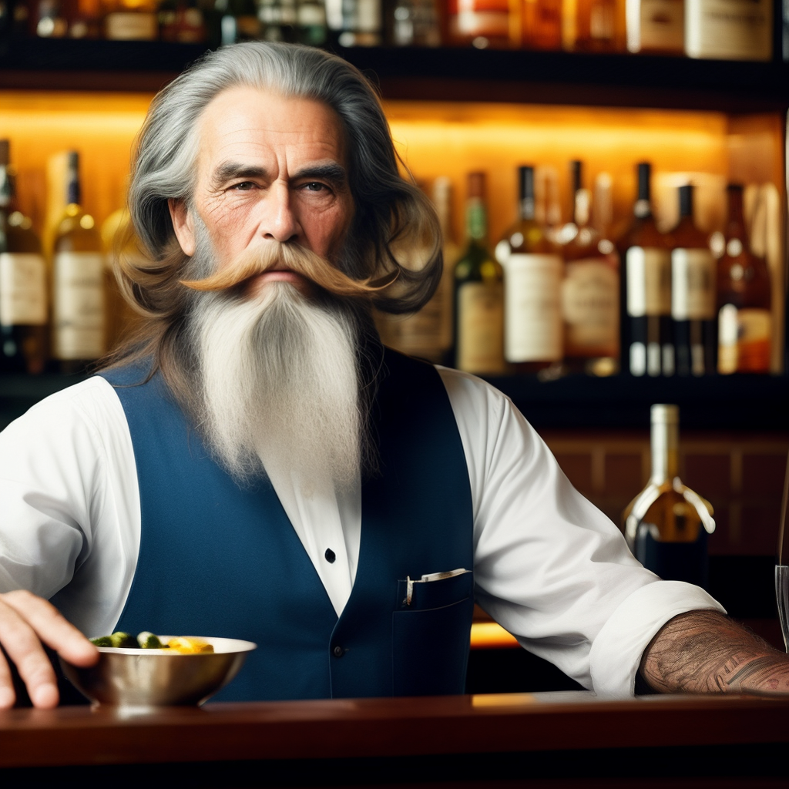

## Understanding Negative Prompts

Negative prompts play a crucial role in refining image generations. Using the `--neg` command followed by your "negative prompt text" ensures certain elements or characteristics are excluded from your generated image. 

There are two primary objectives when utilizing negative prompts:
1. **Exclude Specific Elements**: Remove certain unwanted items or features from your generated images.
2. **Enhance Image Quality**: Improve the overall aesthetics or reduce artifacts using general negative prompts.

Let's delve into a few examples to clarify these points.

### Excluding Specific Elements
Starting with our familiar bartender example:

```plaintext
/serve-free prompt: old bartender in the bar with a long beard --seed 123
```

{: width="500px" }

Suppose we want to remove the light bulbs from the image, as they might be detracting from its central theme. We can simply add a negative prompt as follows:

```plaintext
/serve-free prompt: old bartender in the bar with a long beard --seed 123 --neg light bulb
```

{: width="500px" }

As evident, the light bulbs are no longer present in the updated image.

### Enhancing Image Quality with General Negative Prompts

The exact phrasing for these general negative prompts may vary based on the specific situation. Mastery in using them comes with experimentation and learning from examples. For this case, let's apply a variety of generic negative prompts:
```plaintext
/serve-free prompt: old bartender in the bar with a long beard --seed 123 --neg light bulb, mutation, duplicated, washed out, lowres, plastic, doll, long neck, extra limbs, text, signature
```

{: width="500px" }

While opinions may vary on which image is superior, this example should offer a clear starting point for your own experimentation with negative prompts.