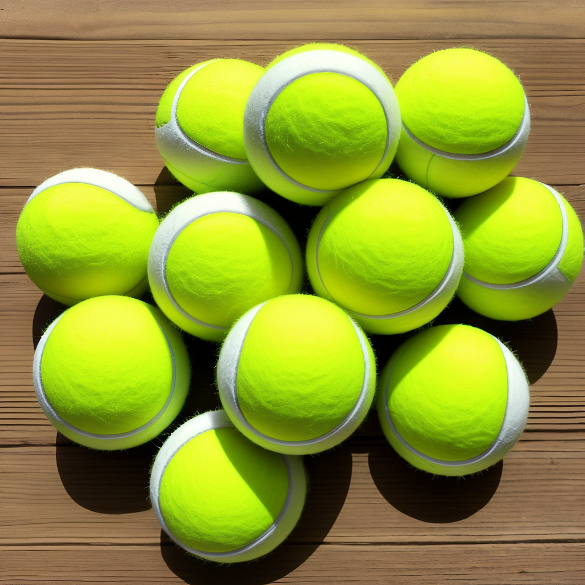

# --raw Parameter

## Overview

The --raw parameter in Distillery is a feature for advanced control, particularly beneficial in specific workflows, especially when using very short prompts. It's a niche but impactful feature.

## Default Behavior vs. Raw

Normally, when a user submits a prompt for image generation, Distillery appends "magic words" to the prompt to generally improve the output images' quality. Currently, the standard appended text might look like: ", best quality, high quality, good."

However, when you add the --raw parameter to your generation command, these appended parts are omitted. This gives the model a more "literal" interpretation of the prompt.

## Example

Here's how using --raw changes the resulted generation:

- Standard prompt (without --raw):
```simpletext
/serve prompt:tennis ball --seed 123
```
{: width="500px" }

- Prompt with --raw:

- Standard prompt (without --raw):
```simpletext
/serve prompt:tennis ball --seed 123 --raw
```
{: width="500px" }

This prompt is taken as it is, without any additional quality-improving words, leading potentially to a different style or quality of the generated image.