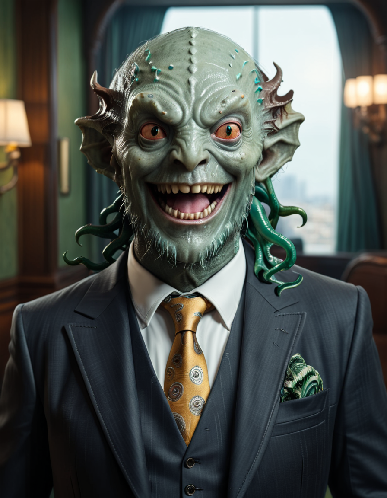
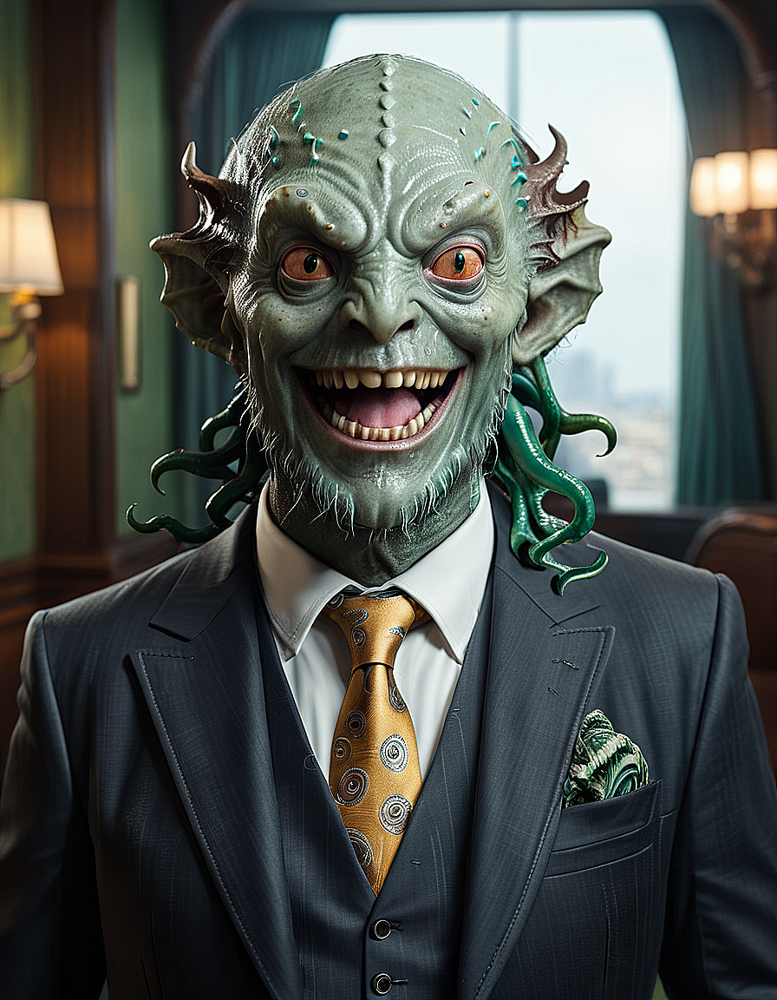

# Sharpen

`--sharpen` is a post-processing tool used by Distillery, which, well, sharpens the generated image with the goal to improve its aesthetics. Post-processing refers to the fact that this is additional processing applied to the image after it was generated. You can adjust the sharpen value by adding `--sharpen <value>` to your prompts. The default value is set to 0.3, and the accepted range of values is from 0 to 1.

!!! warning "Repeated Sharpening"
    
    When doing repetitive workflows, it might be beneficial to set the sharpen value to zero to avoid it being applied repeatedly. In some cases, this could cause "overly sharpened" looks of the image.

## Examples:

### Default Sharpening:

```simpletext
/serve prompt:super detailed portrait of a happy realistic cthulhu billionaire in a suite, uhd, professional cinematic photography --lora photography --model mohawk --seed 123 --ar 3:4
```
This prompt with the default value of `--sharpen 0.3` results in an image that looks like this:
{: width="500px" }


### Disabling Sharpening:
Now let's add `--sharpen 0` to disable sharpening and observe how the aesthetics change:

```simpletext
/serve prompt:super detailed portrait of a happy realistic cthulhu billionaire in a suite, uhd, professional cinematic photography --lora photography --model mohawk --seed 123 --ar 3:4 --sharpen 0
```
{: width="500px" }

The difference is not dramatci but clear.

### Maximum Sharpening:

And finally, let's crank it up to max by adding `--sharpen 1`
```simpletext
/serve prompt:super detailed portrait of a happy realistic cthulhu billionaire in a suite, uhd, professional cinematic photography --lora photography --model mohawk --seed 123 --ar 3:4 --sharpen 1
```
{: width="500px" }

Adjust the sharpening value according to your needs to get the desired effect for your generated images.
