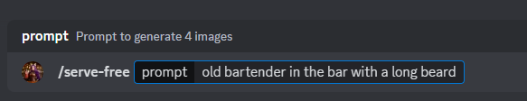
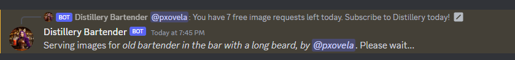
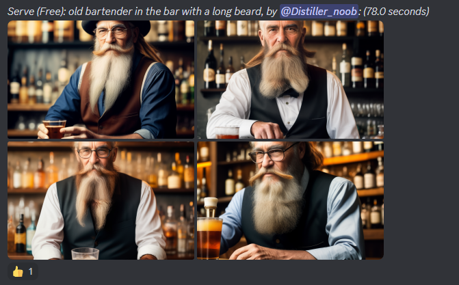

## Welcome to Distillery!!
## Generate amazing images using the cutting edge open-source technologies.

Distillery Bartender bot will serve amazing images from your text prompt and give you a bunch of levers to make them exactly how you want them to look. Directly in Discord without complex installations and specific devices.


!!! warning "Distillery Code of Conduct"
    
    1. **Stay Respectful**: Treat everyone kindly. Rudeness or harassment won't be tolerated.
    
    2. **Mind Your Language**: Casual channels can be lenient, but keep official channels clean. No derogatory terms allowed.
    
    3. **Avoid Spam**: Limit your consecutive messages; strive for at least 5 words in chat.
    
    4. **No NSFW Content**: We're here for creativity, not explicit material.
    
    5. **Advertise Wisely**: Share valuable content in relevant channels. No invasive promotions.
    
    6. **Keep Profiles Tasteful**: Ensure your usernames and profile pictures are appropriate.
    
    7. **Raiding Is Off-Limits**: It violates Discord’s terms. Offenders may face a ban.
    
    8. **No Threats**: Threatening behavior is a serious violation.
    
    9. **Uphold Discord’s Standards**: Abide by the [Discord Community Guidelines](https://discord.com/guidelines).
---

## Start with Distillery Image Generation

### 1. Log In (or Register) To Discord

- [Register on Discord](https://discord.com/login)
- [Make sure to verify your account](https://support.discord.com/hc/en-us/articles/6181726888215)

### 2. Join the Distillery Server
- [Simply follow this link](https://discord.gg/7pda9z6btE)

### 3. Start Generating Daily Free Images!
You can head straight to #free-generations channel to get started with daily free images.

* type `/serve-free` or select the command from the list
* next, enter the text description of the image you want to generate
* finally, press enter



```plaintext
/serve-free prompt: old bartender in the bar with a long beard
```

!!! note "Tip for Quality Outputs"
    High-quality prompts make a massive difference when it comes to generating high-quality images. Check out some examples from the `#get-inspired` channel on Distillery Discord or head to <a href="https://civitai.com/images" target="_blank">https://civitai.com/images</a> to see prompts used by the Stable Diffusion enthusiast community to generate a wide range of images.


### 4. Image Generation Process
After sending the command, Bartender will display a message that your request was receieved.



You have to wait for a bit (typically ~60-80 seconds) and your generated images will show up.



Click on any of them to preview full size. Images in Distillery come upscaled and separated so you can simply save any (or all) that you like!

---

## What's next?
There is a lot more that Distillery allows one to do, make sure to read further details to master what's possible here!

You can use /command-infos in Distillery Discord for a quick summary of some of the controls

- [Subscriptions](Subscriptions/subscriptions_overview.md)
- [Parameters](Parameters/parameters_overview.md)
- [Other Workflows](Alternative Workflows/commands_overview.md)

---
